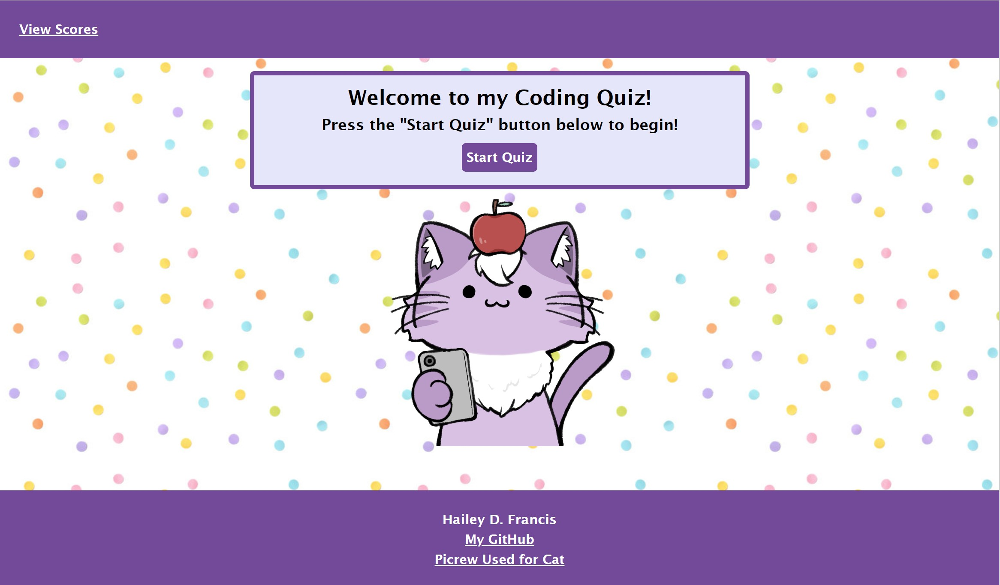
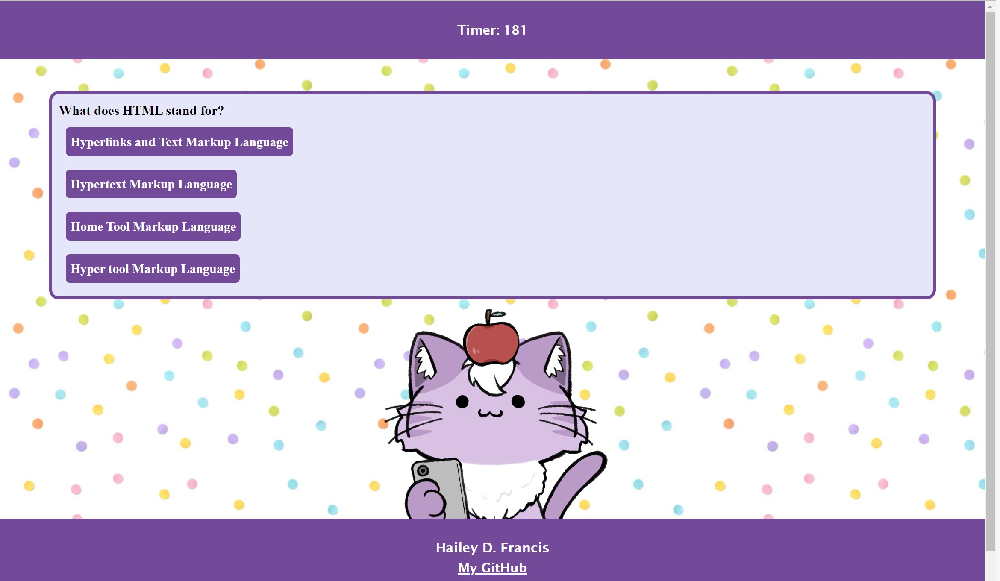
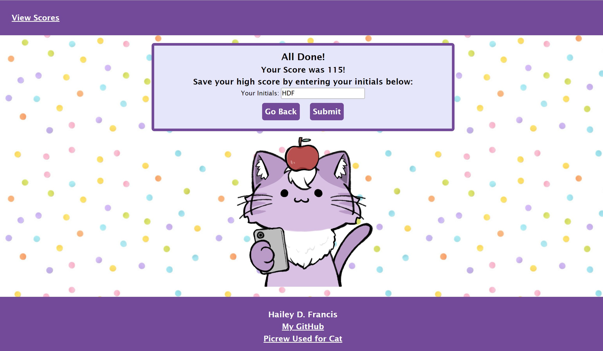
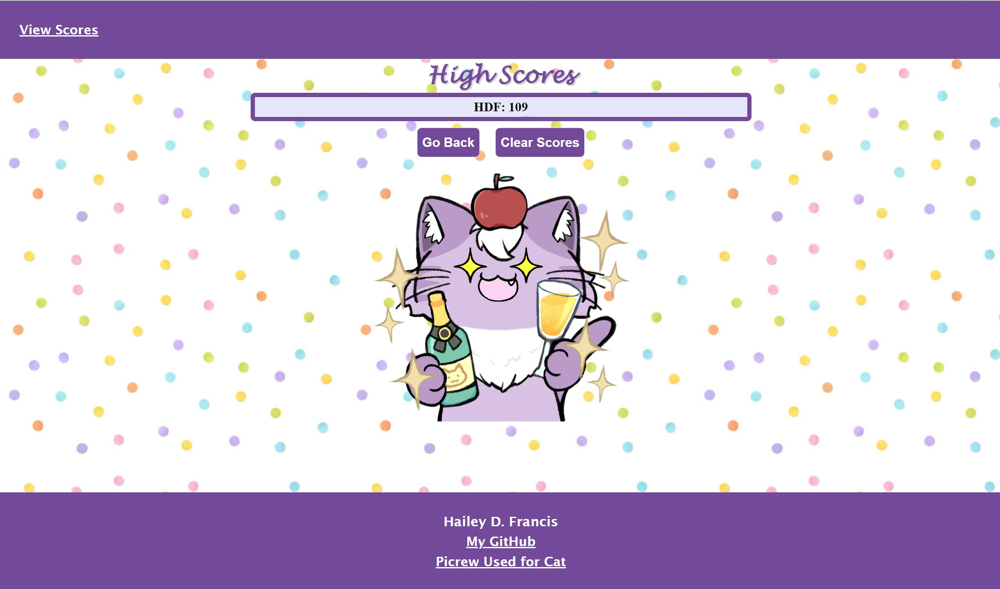

# Module4Challenge-CodingQuiz
This is for Week 4's coding challenge for UCF's Coding Bootcamp (Part-Time October 2022) where we were tasked with creating a simple Coding Quiz that would provide HTML/CSS/JavaScript coding questions to the user, the user's score would be based on a timer with the time reducing for every incorrect answer, and the user would be able to see personal high scores using the local storage from the browser.

## Description
This coding quiz has __ coding questions. When the user presses the "Start Quiz" button, they will be presented with the first question. Every question they answer will display the next question until the end of the quiz. <br>

Once the quiz is over, the user will have the option to save their score, inputting their initials. The user will be prompted whether they want to overwrite their previous score or not if they've used the same initials previously. <br>

Clicking on the "View Scores" link will display all of the previous scores and initials that the user has saved. Since this is using local storage, it only saves scores that the user has saved locally on their current browswer. The user has the option to clear these scores, which clears the entire local storage. <br>


## Live Link
https://hfrancis7.github.io/Module4Challenge-CodingQuiz/

## Screenshots
Welcome to My Quiz Page:<br>
 <br>

Example Question Page: <br>
 <br>

Quiz Complete Page: <br>
 <br>

High Scores Page: <br>
 <br>


## Known Issues
- The cat currently just floats below the main body text rather than sticking to the footer. At some screen sizes, it does sink behing the footer, although this is not intentional. Since this wasn't a project requirement and did not pose an issue to its functionality, it has been as is for now.
- The way that local storage is being used requires for the rest of local storage to be empty for the high scores to display properly. This doesn't seem to be anything that breaks the code, and local storage can be cleared with the "Clear Storage" button, but nontheless all elements in local storage are displayed in the high scores list when clicking "view scores"

## User Story
```
AS A coding boot camp student
I WANT to take a timed quiz on JavaScript fundamentals that stores high scores
SO THAT I can gauge my progress compared to my peers
```

## Acceptance Criteria
```
GIVEN I am taking a code quiz
WHEN I click the start button
THEN a timer starts and I am presented with a question
WHEN I answer a question
THEN I am presented with another question
WHEN I answer a question incorrectly
THEN time is subtracted from the clock
WHEN all questions are answered or the timer reaches 0
THEN the game is over
WHEN the game is over
THEN I can save my initials and my score
```
